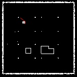
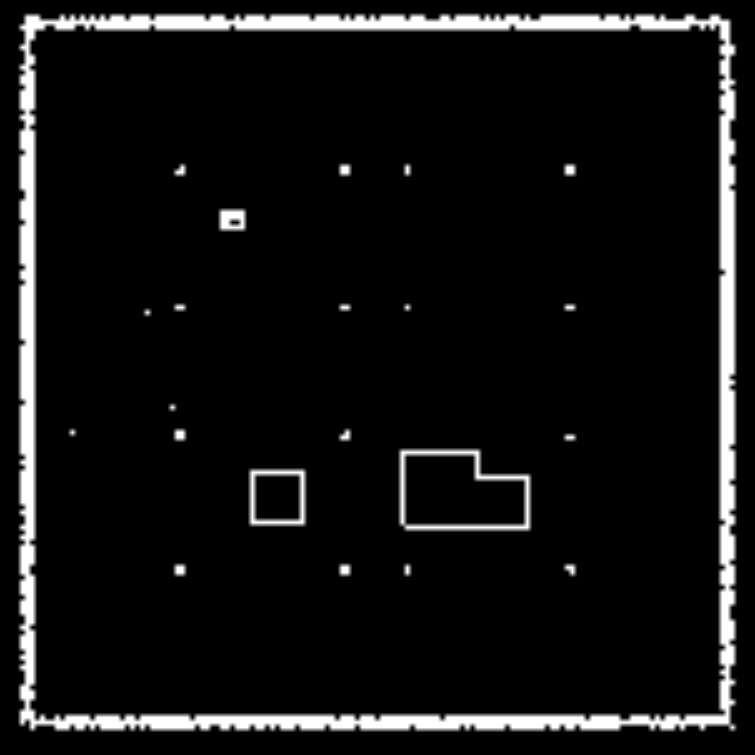

# robot_path_planning
---
**Dependencies:** OpenCV и PCL.

---
To compile and execute project change paths in the **run.sh** to your repo directory and then run **run.sh** by running the command:
```bash
bash run.sh
```
---
You can see the results below:



Upscaled images:


---
## Assumptions made:
- point cloud contains only point coordinates
- point cloud metric is meters
- noise threshold for occupancy grid height is 0.15 (16.5 centimeters, which might be too high but that gives a decent grid from this particular point cloud)
---
This code has embedded start and goal points for the **A\*** algorithm. If you want to change them you will have to edit main.cpp at lines 135, 136:
```cpp
    AStar::Node goal(48, 46, 0, 0, nullptr);
    int startX = 40, startY = 35;
```
